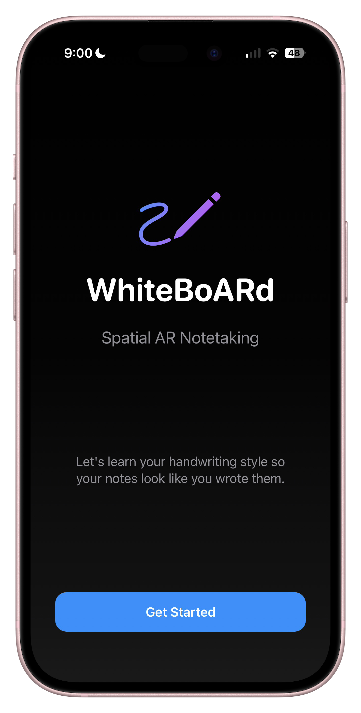
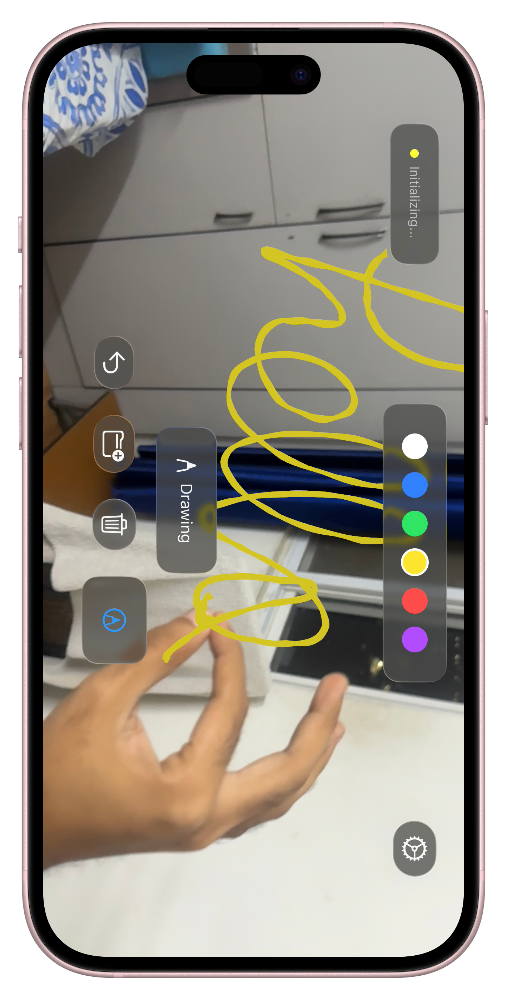
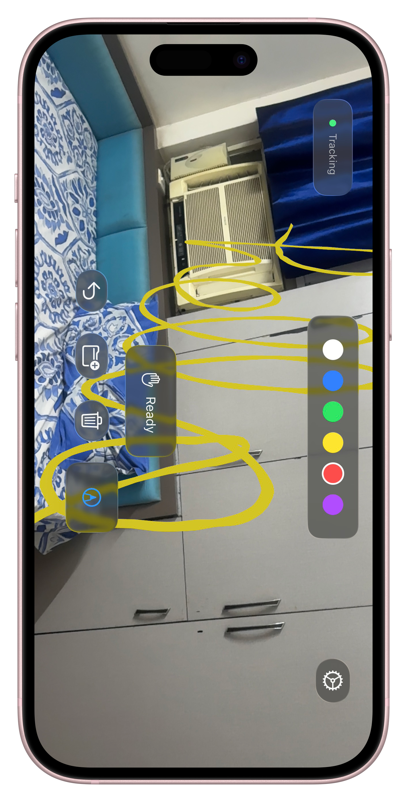

# SpatialBoard - Spatial AR Notetaking

A spatial AR notetaking app for iPhone with LiDAR that lets you draw, organize, and solve math in 3D space using hand gestures.

## Demo Video

[](https://youtu.be/NDZyi6bChMY)

## Screenshots

<p align="center">
  
</p>

<p align="center">
  
  
</p>

## Requirements

| Component | Version / Requirement |
| --- | --- |
| iOS | 26.0 or later |
| Xcode | 17.0 or later |
| Swift | 6.0 |
| Device | iPhone with LiDAR, ARKit, and depth sensor support |

The app is built as a Swift Package / Xcode app target and is intended for physical device testing. Simulator support exists for limited logic and UI flows, but full AR, LiDAR, and hand-tracking features require supported hardware.

## Project Versions

- App version: 1.0
- Build number: 1
- Swift tools version: 6.0
- Minimum platform: iOS 26.0

## Features

### Spatial Canvas
- Notes anchored to real-world coordinates using ARKit WorldAnchors
- Persistent notes across app sessions via SwiftData
- 3D folder entities to organize notes in space
- Depth-aware drawing plane locking for stable stroke placement
- Space-based isolation so each workspace shows only its own content

### Hand Gesture System (Vision Framework)
- **Pinch** (thumb + index): Draw mode
- **Two-hand pinch**: Selection rectangle
- **Palm (while selected)**: Move selected strokes/folders in 3D
- **Pinch (while selected)**: Resize selected content
- **Open Palm**: Erase mode (disabled while selection is active)
- **Pointing**: Folder hover open/close trigger
- Real-time 2D hand landmark detection with optimized 3D positioning
- Pinch hysteresis to prevent flickering at gesture boundaries
- Depth-aware palm/point raycasting for more reliable movement and interaction

### Drawing
- Strokes captured as bezier curves
- Rendered as 3D tube meshes via RealityKit MeshResource
- Stored as world-anchored entities
- Smooth stroke start with initial point stabilization
- Partial stroke erasing with segment splitting and persistence
- Selection outlines and folder target glow feedback during drag/drop

### Selection, Move, Resize, and Folders
- 2D selection rectangle projected from two-hand pinch into AR scene entities
- Selected stroke/folder move with palm-locked tracking and smoothing
- Stroke billboard behavior preserved while moving; folder billboard behavior preserved independently
- Drag-and-drop absorption: moved strokes can be dropped into folders by proximity
- Folder open/close by pointing hold, with transition status updates
- Prevents erasing selected strokes until deselected

### Spaces Workflow
- Multiple named spatial workspaces ("Spaces")
- Animated fade transition when switching spaces
- Strokes and folders are tagged with `spaceID` and loaded per active space only
- Space creation and switching from the floating UI
- iOS-style swipe-to-delete for user-created spaces in the Spaces sheet

### Handwriting Style Matching
- Onboarding captures A-Z letterforms
- Kon continuously learns from your AR strokes on-device
- Character segmentation + OCR pipeline feeds live glyph samples into Kon profiles
- Generated answer strokes are rendered in your writing style

### Kon Math Solving and 3D Equation Targeting
- Kon captures visible equation strokes from the AR view and sends an optimized image to Gemini
- Uses depth-culling to choose the physically nearest equation slab, reducing confusion from background writing
- Equation solving is intentionally focused on the closest plane around the screen focal region
- Kon writes answers back into AR near the detected equation using your style

### OCR and Symbol Parsing
- Structured OCR pipeline with Vision token extraction and fallback plain-text OCR
- Layout-aware math parsing heuristics (superscript/subscript, sqrt and fraction hints)
- Internal normalization path for robust parsing plus symbol-first rendering path for output

### Performance Optimizations
- Non-blocking Vision processing on dedicated queue
- Throttled hand tracking with gesture-priority processing
- Minimal 3D raycast conversions (only when needed)
- LiDAR depth sampling at 15fps with 2-joint tracking
- Throttled billboard updates and distance culling for scene stability
- Optimized memory management with autoreleaseFrequency

## Project Structure

```
WhiteBoARd/
├── WhiteBoARd/
│   ├── frontend/
│   │   ├── WhiteBoARdApp.swift      # Main app entry point
│   │   ├── ARCanvasView.swift       # RealityKit AR view
│   │   ├── DrawingOverlay.swift     # Hand tracking visualization
│   │   ├── OnboardingView.swift     # Handwriting capture flow
│   │   └── SpacesPickerView.swift   # Space switching and management sheet
│   ├── backend/
│   │   ├── Models.swift             # SwiftData models
│   │   ├── ARSessionManager.swift   # ARKit session handling
│   │   ├── GeminiService.swift      # Gemini API integration
│   │   ├── StrokeProcessor.swift    # Bezier/mesh conversion
│   │   ├── MetalStrokeProcessor.swift # GPU-accelerated processing
│   │   ├── HandwritingStyleStore.swift # Character templates
│   │   ├── GestureRecognizer.swift  # Vision hand tracking
│   │   ├── CharacterSegmenter.swift # OCR + character-to-stroke mapping for Kon
│   │   └── Kon.swift                # Handwriting imitation engine
│   ├── assets/                      # Demo images and video
│   ├── Assets.xcassets/
│   └── Info.plist
├── WhiteBoARd.xcodeproj/
└── Package.swift
```

## Setup

1. Open [WhiteBoARd.xcodeproj](WhiteBoARd.xcodeproj) in Xcode 17+
2. Set your development team in Signing & Capabilities
3. Configure Gemini API key:
   - Set `GEMINI_API_KEY` environment variable, or
   - Call `GeminiService.shared.configure(apiKey: "your-key")`
4. Build and run on a physical iPhone Pro device (LiDAR required)

## API Configuration

### Gemini (Kon Math)
- Primary model: `gemini-3.1-flash-lite`
- Fallback chain: `gemini-2.5-flash`, `gemini-2.0-flash`
- Endpoint pattern: `https://generativelanguage.googleapis.com/v1beta/models/<model>:generateContent`
- Thinking level: `minimal` for low-latency solving

## Architecture

### Backend Services
- **ARSessionManager**: Singleton managing ARKit session, world anchors, and raycasting
- **GeminiService**: Actor for thread-safe API calls to Gemini
- **StrokeProcessor**: Converts stroke points to bezier curves to 3D meshes
- **MetalStrokeProcessor**: GPU-accelerated stroke processing for complex drawings
- **HandwritingStyleStore**: Stores and warps character templates
- **GestureRecognizer**: Vision framework hand pose detection with dedicated processing queue
- **CharacterSegmenter**: OCR + segmentation layer feeding new samples to Kon
- **Kon**: Imitation engine that renders generated text in user style

### Frontend Views
- **ARCanvasView**: UIViewRepresentable wrapping RealityKit ARView
- **DrawingOverlay**: Canvas overlay showing hand landmarks
- **OnboardingView**: Multi-step handwriting capture wizard
- **SpacesPickerView**: Workspace manager with create, switch, and swipe-delete

### Data Persistence
- **SwiftData** for all persistence
- Models: `SpatialStroke`, `PersistedWorldAnchor`, `SpatialFolder`, `CharacterTemplate`, `GlyphSample`, `Space`
- World anchor positions stored for recovery
- Space-scoped entities via `spaceID` tagging

## Simulator Support

The app includes `#if targetEnvironment(simulator)` guards for testing:
- Mock AR session state
- Simulated hand landmarks
- Mock raycasting results

Logic can be tested in simulator, but full AR features require physical device.

## iOS Features

- **Liquid Glass UI**: Material effects on toolbar and controls
- **Swift 6**: Full concurrency support with actors
- **SwiftData**: Modern persistence framework
- **Observation**: `@Observable` macro for state management

## License

MIT License
